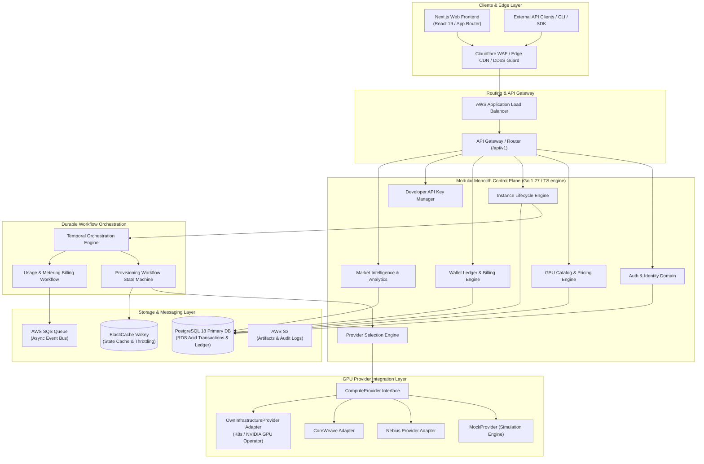
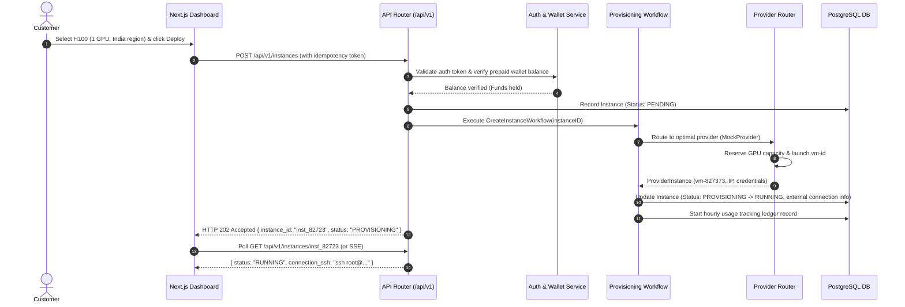

# System Architecture & Technical Design

## 1. Executive Summary

This document describes the high-level architecture of the **NVIDIA GPU Cloud Compute Marketplace & Control Plane**. The platform is designed as an infrastructure-agnostic, multi-tenant cloud control plane. It abstracts underlying GPU capacity providers (external partners initially, and internal bare-metal/Kubernetes GPU clusters in the future) behind a unified, robust domain model and API interface.

---

## 2. Platform Architecture Diagram

---

## 3. High-Level Data & Request Flow

---

## 4. Key Architectural Decisions & Principles

1. **Strict Resource Abstraction (Customer ID vs Provider ID)**:
   Customers interact strictly with clean platform IDs (e.g. `inst_948271`). Internal provider details (e.g. `vm-nebius-88371` or `mock-instance-123`) are encapsulated within the provider translation layer and never exposed in customer state or API responses.

2. **Prepaid Double-Entry Transaction Ledger**:
   Financial transactions (deposits, hourly compute charges, refunds) are handled through append-only wallet transaction entries (`wallet_transactions`). No direct floating-point mutations on raw balances.

3. **Durable Workflow Execution**:
   Long-running provisioning steps (validating capacity, requesting VM, waiting for network initialization, health checks, teardown) are managed by Temporal workflows with automatic retries, saga rollbacks, and idempotency guarantees.

4. **Modular Monolith Architecture**:
   All core domains reside within a single cohesive binary/repository structure (`services/control-plane`), structured cleanly into domain packages. This prevents unnecessary microservice distributed overhead during MVP phase while allowing domain separation for future extraction.
