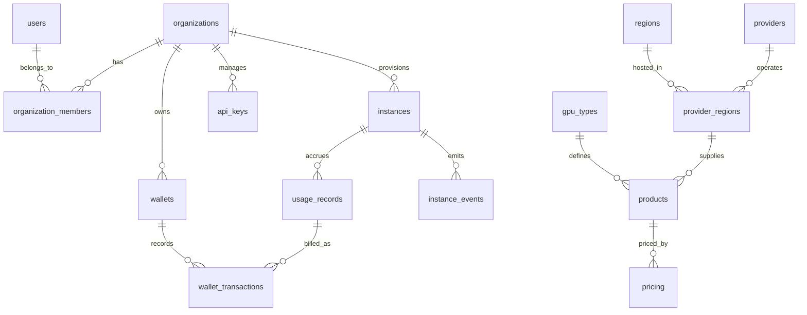

# Database Schema & Entity Design

## 1. Overview

The GPU Cloud Platform uses **PostgreSQL 18** as its primary relational store.
All primary keys use UUID v4 or prefixed deterministic IDs (e.g. `usr_...`, `org_...`, `inst_...`).

---

## 2. Entity Relationship Diagram (ERD)

---

## 3. Core Tables Specification

### Core Identity & Multi-Tenancy
* `users`: `id`, `email`, `full_name`, `password_hash`, `status`, `created_at`, `updated_at`
* `organizations`: `id`, `name`, `slug`, `owner_id`, `created_at`, `updated_at`
* `organization_members`: `id`, `organization_id`, `user_id`, `role` (`owner`, `admin`, `member`, `viewer`), `created_at`
* `api_keys`: `id`, `organization_id`, `user_id`, `name`, `key_prefix`, `hashed_secret`, `last_used_at`, `expires_at`, `created_at`

### GPU Catalog & Provider Capacity
* `gpu_types`: `id`, `name`, `code`, `architecture`, `vram_gb`, `cuda_cores`, `tensor_cores`, `fp64_tflops`, `fp32_tflops`, `fp16_tflops`, `interconnect`, `description`, `created_at`
* `regions`: `id`, `code`, `name`, `country`, `datacenter`, `status`, `created_at`
* `providers`: `id`, `code`, `name`, `is_active`, `created_at`
* `provider_regions`: `id`, `provider_id`, `region_id`, `provider_region_code`, `status`
* `products`: `id`, `gpu_type_id`, `provider_region_id`, `gpu_count`, `vcpu_count`, `ram_gb`, `storage_gb`, `is_available`, `created_at`
* `pricing`: `id`, `product_id`, `provider_hourly_cost_inr`, `customer_hourly_price_inr`, `platform_margin_inr`, `is_active`, `effective_from`

### Compute Instances & Infrastructure State
* `instances`: `id`, `organization_id`, `user_id`, `product_id`, `name`, `status` (`PENDING`, `PROVISIONING`, `RUNNING`, `STOPPING`, `STOPPED`, `RESTARTING`, `TERMINATING`, `TERMINATED`, `FAILED`), `ssh_public_key`, `connection_ip`, `connection_port`, `ssh_username`, `provider_id`, `provider_instance_id`, `created_at`, `started_at`, `stopped_at`, `terminated_at`
* `instance_events`: `id`, `instance_id`, `event_type`, `message`, `metadata_json`, `created_at`
* `provisioning_requests`: `id`, `instance_id`, `workflow_id`, `status`, `idempotency_key`, `error_message`, `created_at`

### Ledger, Billing & Usage
* `wallets`: `id`, `organization_id`, `balance_inr`, `currency`, `created_at`, `updated_at`
* `wallet_transactions`: `id`, `wallet_id`, `amount_inr`, `type` (`DEPOSIT`, `USAGE_CHARGE`, `REFUND`, `CREDIT_ADJUSTMENT`), `description`, `reference_id`, `balance_after_inr`, `created_at`
* `usage_records`: `id`, `instance_id`, `organization_id`, `product_id`, `start_time`, `end_time`, `duration_seconds`, `rate_per_hour_inr`, `total_charge_inr`, `billing_status`, `created_at`
* `payments`: `id`, `organization_id`, `wallet_id`, `provider` (`RAZORPAY`, `MOCK`), `payment_id`, `order_id`, `amount_inr`, `status`, `created_at`

### Market Intelligence & Audit
* `market_demand_events`: `id`, `organization_id`, `gpu_type_code`, `region_code`, `action` (`VIEWED`, `CONFIGURED`, `DEPLOY_ATTEMPTED`), `workload_category`, `created_at`
* `audit_logs`: `id`, `organization_id`, `user_id`, `action`, `resource_type`, `resource_id`, `details_json`, `ip_address`, `created_at`
