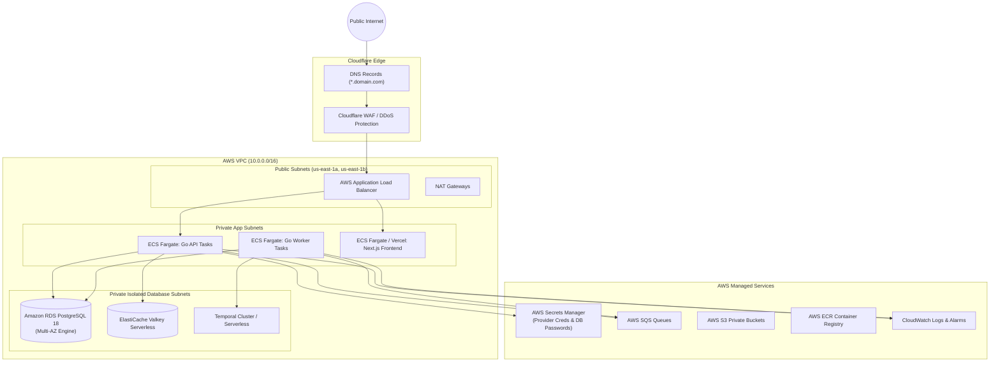

# AWS Deployment Architecture & Infrastructure as Code (CDK)

## 1. Production AWS Topography

---

## 2. Container Registry & Artifacts
* `gpu-cloud-web`: Next.js 16 Production Docker Container (`Dockerfile.web`)
* `gpu-cloud-api`: Go 1.27 Control Plane API Binary Container (`Dockerfile.api`)
* `gpu-cloud-worker`: Go 1.27 Worker Container (`Dockerfile.worker`)

---

## 3. Infrastructure as Code (AWS CDK TypeScript)

Located under `infra/aws-cdk/`:
* `VpcStack`: Provision VPC with dual Availability Zones, Public/Private/Isolated subnets, NAT Gateways.
* `DatabaseStack`: RDS PostgreSQL 18 Multi-AZ instance with encryption at rest via AWS KMS.
* `EcsClusterStack`: ECS Cluster on AWS Fargate with auto-scaling policies based on CPU/RAM and target response times.
* `SecretsStack`: AWS Secrets Manager integration for secure runtime access to payment secrets, provider keys, and JWT secrets.
